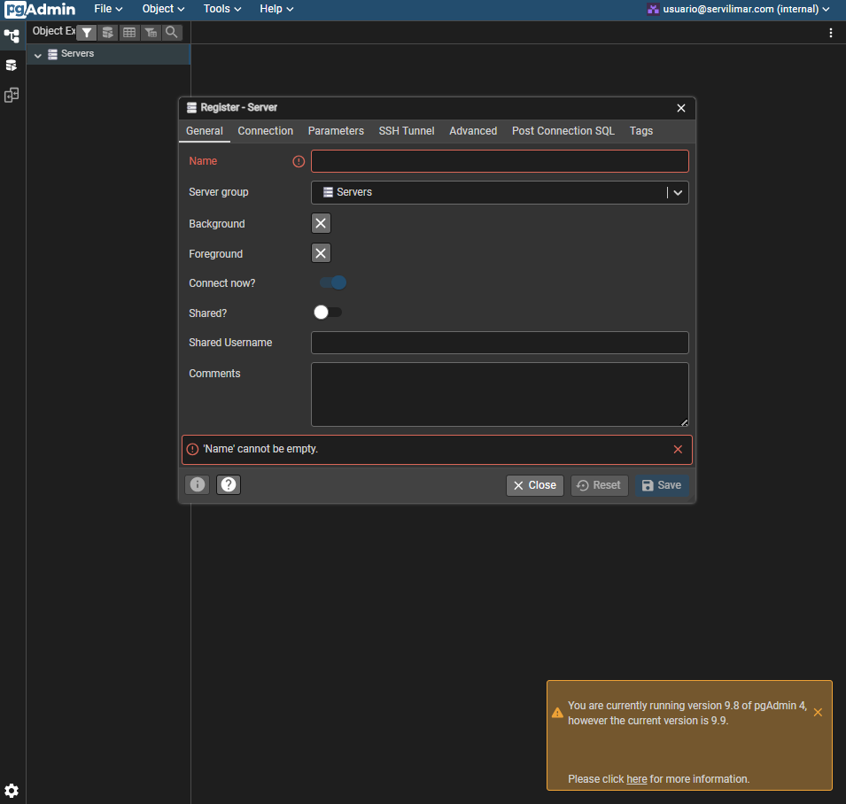
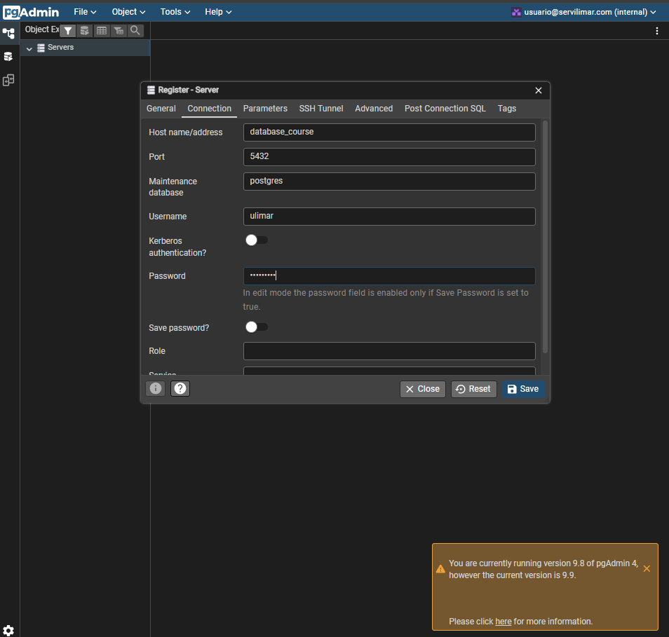
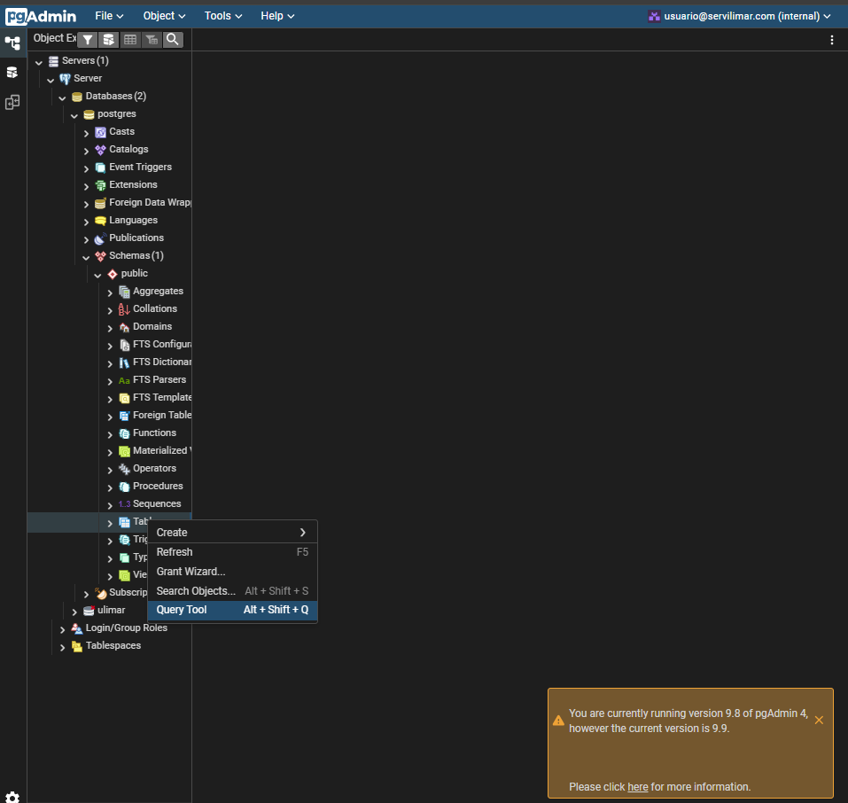

## Descripcion
Este proyecto demuestra la configuración y despliegue de un sistema de generación de turnos llamado LiMar, 
utilizando Docker, PostgreSQL 14 y pgAdmin 4.
Incluye las instrucciones de creación (DDL) e inserción (DML) de tablas para la base de datos servilimar.

## Requisitos:
-Tener intalado Docker.

## Instrucciones:
-Crear contenedor de postgres sql(Si usa windows, después de ejecutar este comando, 
deberá abrir una nueva pestaña del terminal para ejecutar el siguiente comando, y dejar ejecutando esta):
docker run --name database_course -e POSTGRES_USER=ulimar -e POSTGRES_PASSWORD=ex4men_db -p 5432:5432 postgres:14

-Crear contenedor de pgadmin:
docker run --rm -p 5050:80 --link database_course:database_course -e "PGADMIN_DEFAULT_EMAIL=usuario@servilimar.com" -e "PGADMIN_DEFAULT_PASSWORD=limar#123" -d dpage/pgadmin4

-Abra una pestaña de su navegador de preferencia, después de esperar unos segundos y busque: 
http://localhost:5050/login

-En el login ingrese, el usuario y contraseña que se estableció en el segundo comando(usuario@servilimar.com, limar#123).

-Una  vez en postgres, de click derecho sobre server, register> server, asignas un nombre de tu preferencia:

-Ingresa los siguientes datos(password: ex4men_db):

-Sigue la siguiente ruta hasta llegar a Query Tool, aquí solo debes copiar y pegar las tablas y 
registros en los archivos adjuntos Registros y Tablas.

